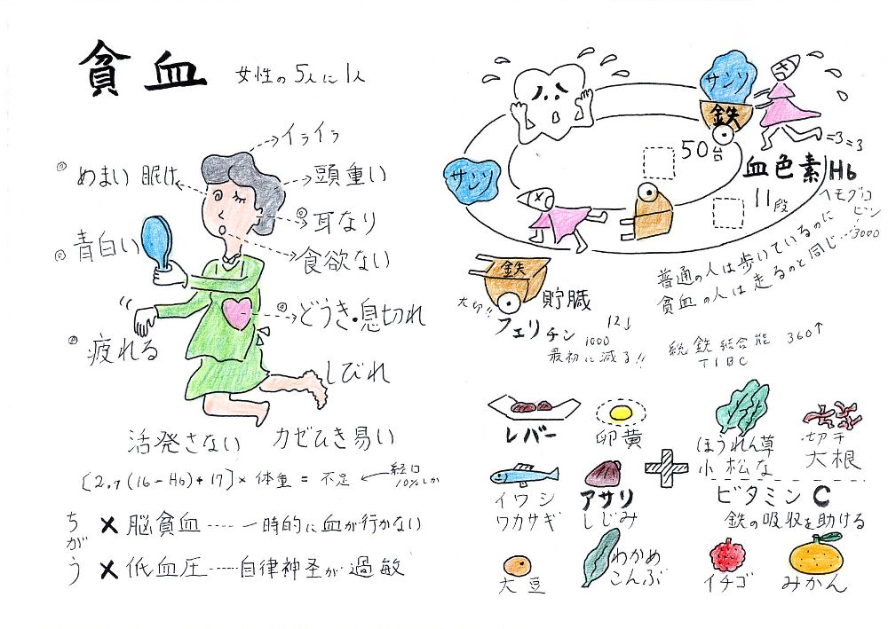
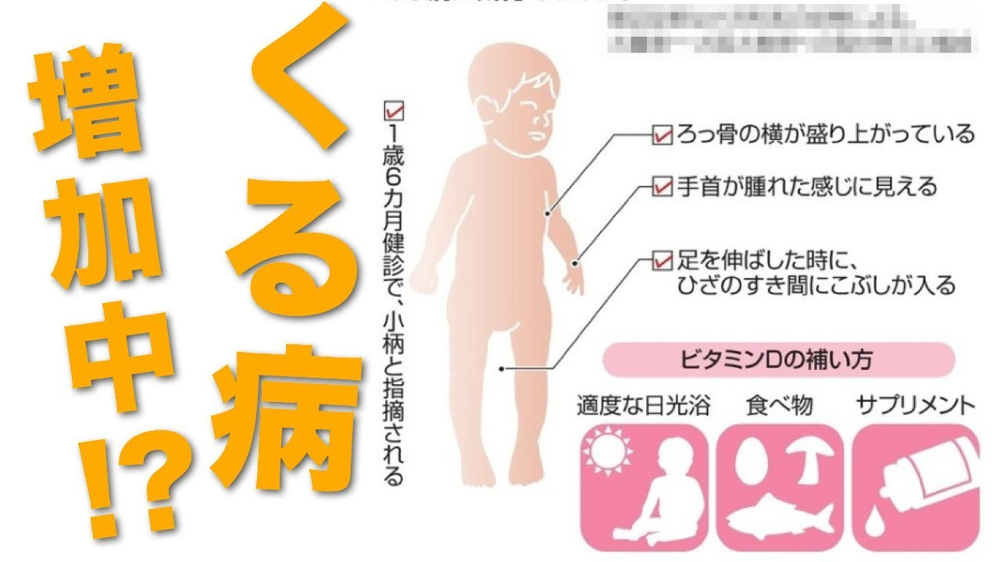

---
# 本日の内容

--

### 病気と食事・栄養素

--

- 欠乏症

--

- 生活習慣病

--

### 食事調査と栄養疫学研究

--

- 日本人の食事摂取基準

--

- 国民健康・栄養調査

???
では，今日は主にこの２つの話題について，講義を進めたいと思います．
一つ目は，栄養学と人の健康に関して，つまり，病気と栄養素について，詳しく，例を見ながら紹介したいと思います．
２つ目は，病気と栄養の関係がうまく理解できるようになったら，その次のステップでは，病気の予防や治療のための栄養学におけるエビデンスの考え方，エビデンスを得られるための研究手法の基本的な概念をまとめたいと思います．

---
class: inverse, center, middle

# 栄養素欠乏症  Nutritional Deficiency

---
class: center, top
background-image: url(img/hungry.png)

# 飢餓による栄養失調症

---
class: center, top
# 鉄欠乏性貧血

---
class: center, top
# くる病

---
class: inverse, center, bottom
background-image: url(https://upload.wikimedia.org/wikipedia/commons/d/d4/James_Lind_by_Chalmers.jpg)

# 世界初の症例対象研究
### [ジェイムズ・リンド(James Lind, 1716-1794)](https://ja.wikipedia.org/wiki/%E3%82%B8%E3%82%A7%E3%83%BC%E3%83%A0%E3%82%BA%E3%83%BB%E3%83%AA%E3%83%B3%E3%83%89)

???
16世紀から18世紀の大航海時代「だいこうかいじだい」には、ある病気の原因が分からなかったため、海賊以上に怖かったと思われます。ヴァスコ・ダ・ガマのインド航路発見の航海においては、180人の船員「せんいん」のうち100人がこの病気にかかって死亡しました。

---
class: center, bottom

background-image: url(img/kaiketsu.jpg)

???
症状：歯肉「はにく」は 歯根「しこん」のあたりまで腐り「くさり」，頬「ほお」は硬く腫れ上がって，ぐらつく歯は今にも抜けそうになる．...... 息は臭く，足には力が入らず，体のいたるところが疼き「うずき」，青や赤のあざができる．

---
class: center, bottom

background-image: url(img/kaiketsu1.jpg)

---
class: center, bottom

background-image: url(img/jameslind.jpg)

???
He took 12 men suffering from similar symptoms of scurvy, divided them into six pairs and treated them with remedies suggested by previous writers: a quart of cider a day; 25 drops of elixir of vitriol, three times a day; half a pint of sea-water a day;  a nutmeg-sized paste of garlic, mustard seed, horse-radish, balsam of Peru, and gum myrrh three times a day; two spoonfuls of vinegar, three times a day; two oranges and one lemon a day; By the end of the week, those on citrus fruits were well enough to nurse the others.

---
高木兼寛「たかきかねひろ」(1849-1920)の貢献
- 脚気「かっけ」の撲滅

---
生活習慣病
-

---
class: center, middle
## 食事調査 (dietary assessment)

> 人が**何**を**どれだけ**食べているかを抜きにした栄養学はありえない．
> なぜなら，食品は人がそれを食べた瞬間に食品になるであって，それまではただの**モノ**でしかないからである．

>

---
class: center, middle
## 食事調査の種類：

調査法  |　メリット   | デメリット
:--|:---|:--
陰膳法 (duplicate method) |・記憶に依存しない　  ・食品成分表の精度に依存しない |  ・負担が大きい  ・食事が通常と異なる ・手間と費用がかかる
||
食事記録法 (diet record)  |・記憶に依存しない |・負担が大きい ・食事が通常と異なる
||
24時間食事思い出し法 (diet recall)|・負担が小さい|・記憶に依存する
||
食物摂取頻度調査法 (food frequency method)|・簡単 ・時間と労力が少ない|・結果は限られる

???
- **陰膳法「かげぜん」**は、実際に被験者が摂取した食事と同じものを**化学分析**し、摂取栄養素量を推定するものである。通常は各家族でもう１人前多く食事をつくってもらい、それを収集する。ホモジェナイズ後凍結、あるいは凍結乾燥を行い、検体数がそろった時点で分析する。集団の平均栄養素摂取状況を把握するのに用いられるが、多くの手間と経費がかかる。また、このような調査に協力してもらう際には、**普段の食事とは異なるもの**に変更されやすいことに留意すべきである。食べた食品の科学分析を実際に行うので、食物成分表のもっている誤差は解消できる。
- **食事記録法**は摂取した食物を調査対象者が自分で調査票に記入し、これにもとにして専門家が食品成分表を用いて栄養素摂取量を計算します。ちなみに、調査対象者が調査票に記入する際、・重量を測定し記入する：**秤量法**　・目安量（お茶碗1杯など）を記入する：目安量法　場合があり、食事記録法はさらに2つに分類されています。
- **24時間食事思い出し法**は前日の食事、または調査時点からさかのぼって24時間分の食物摂取を、調査員が対象者に質問していきます。フードモデルや写真を使って、摂取した目安量を質問し、これにもとにして専門家が食品成分表を用いて栄養素摂取量を計算します。
- **食物摂取頻度調査法**は定めた食品の摂取頻度を、調査票を用いて質問し、これにもとにして専門家が食品成分表を用いて**栄養素摂取量**を計算します。・簡単に調査を行える・データ処理に要する時間と労力が少ない・得られる結果は質問項目や選択肢にあるものに限る

---
国民健康・栄養調査

- 健康増進法に基づき（平成15年から, 2003年）．
- 目的：国民の身体状況，栄養素摂取量，生活習慣を明らかにする．
- 毎年，全国から約5千世帯とその世帯員約1万5千人を対象に実施されている．

???
国民健康栄養調査は，

---

---
class: inverse, middle
#### 問題：**国試108E7**

#### 食事バランスガイドでは

--- 

